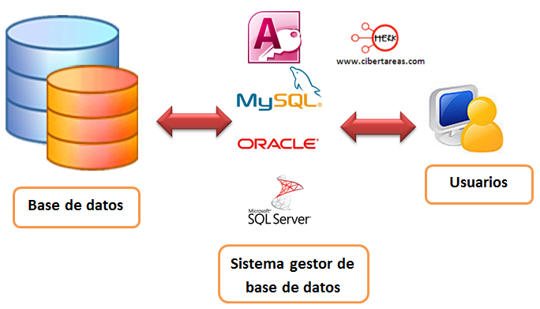

# Base de datos para aplicaciones 

---

Este repositorio contiene informacion de base de datos
referente a los siguientes temas:

1. Consultas con Joins (inner join, left join, right
join y full join)
1. Views
1. Store procedure
1. Triggers
1. Manejo de transacciones
1. Seguridad
1. Desplieguen de aplicaciones

[Definicion de base de datos](https://aws.amazon.com/es/what-is/database/)